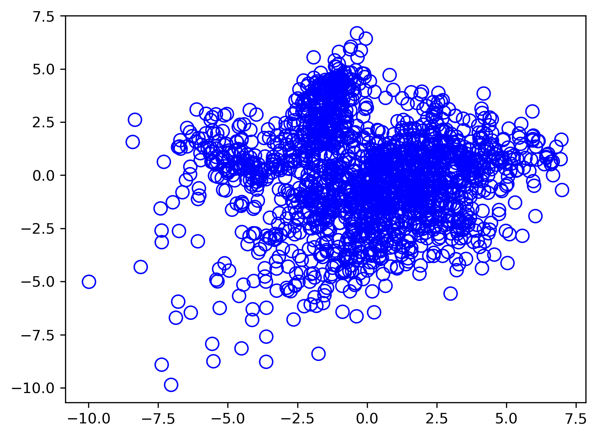
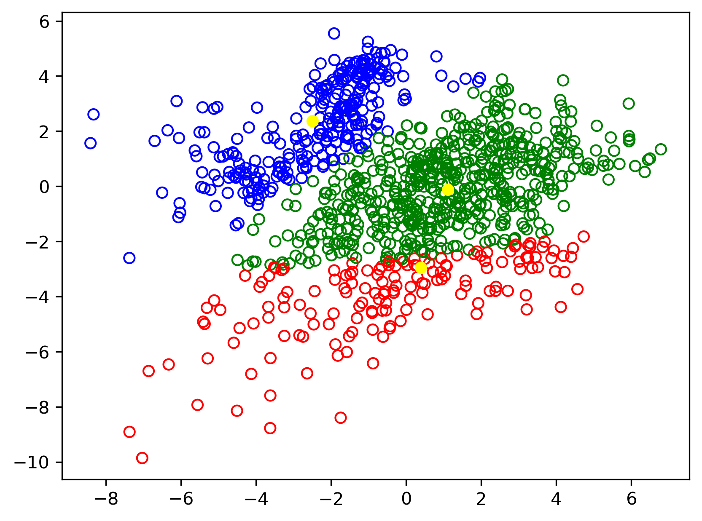

## Principal Component Analysis
This example compares different (linear) dimensionality reduction methods applied on the <a href="https://scikit-learn.org/stable/modules/generated/sklearn.datasets.load_digits.html">Digits</a> data set. The data set contains images of digits from 0 to 9 with approximately 180 samples of each class. Each image is of dimension 8x8 = 64, and is reduced to a two-dimensional data point. 
 
## Gaussian Mixture Models
This dataset is then used as an input for the Gaussian Mixture model and clustered in 3 groups 
 
